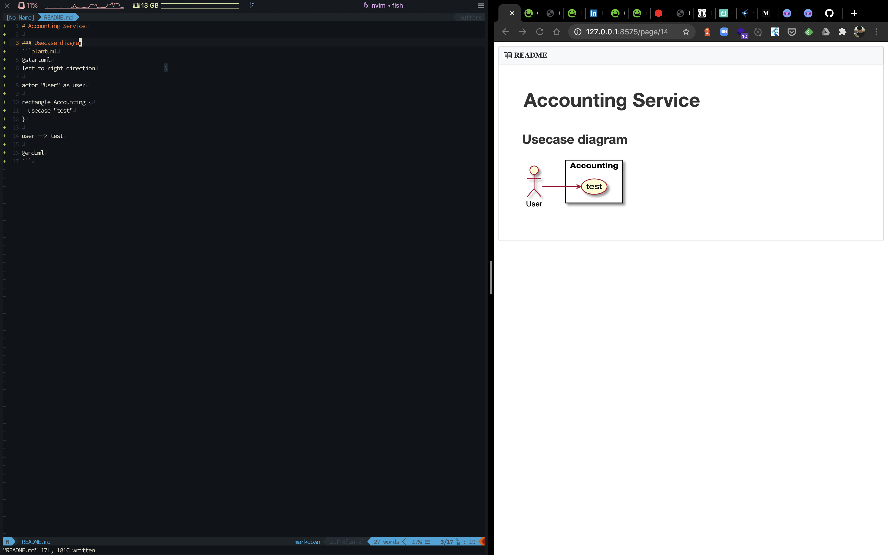

https://github.com/iamcco/markdown-preview.nvim

を使ってリアルタイムプレビューを実現したから、その設定ファイルを公開するよー


dein_lazy.tomlファイルに記述し、遅延実行した。

```toml

[[plagins]]
repo = 'tyru/open-browser.vim'
hook_add = '''
let g:openbrowser_browser_commands = [ {'name': 'google-chrome-stable',  'args': ['{browser}', '{uri}']} ]
'''

[[plugins]]
repo = 'iamcco/markdown-preview.nvim'
on_ft = [ 'markdown', 'pandoc.markdown', 'rmd' ]
build = 'sh -c "cd app & yarn install" '

```


